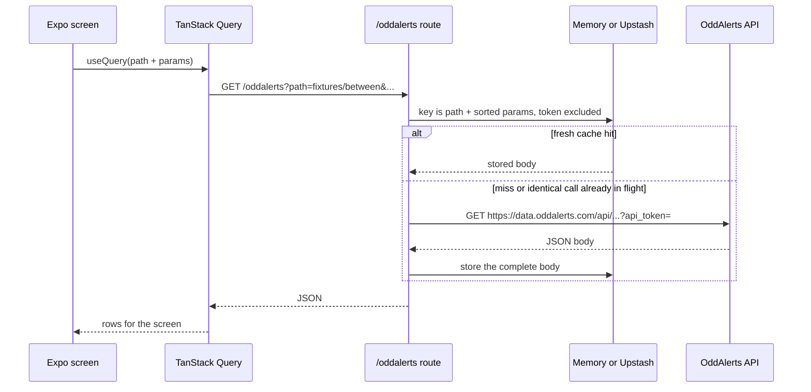
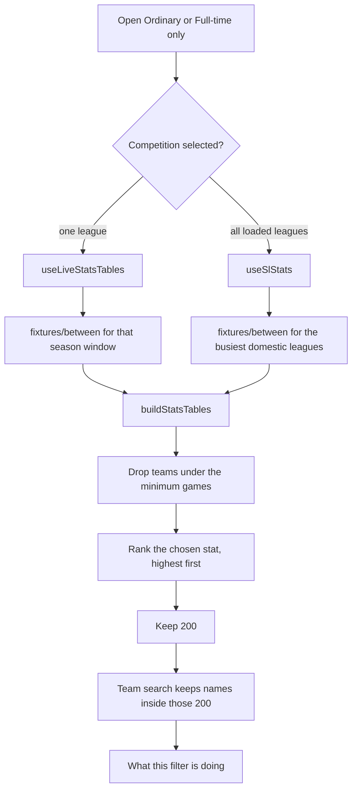
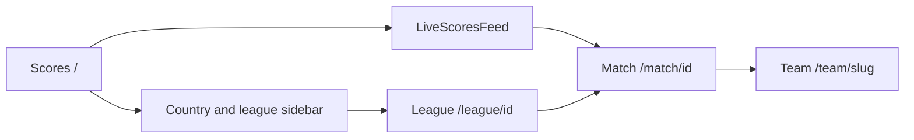

# Scoreline

Football scores and betting intelligence. The app is an Expo (React Native Web) client. OddAlerts is the source of truth for fixtures, results, standings, and season timing. Percentages, streaks, and half-time patterns are counted in the browser from those finished scores. A Python pipeline still exists for the offline SQLite stats bundle and the TensorFlow.js model, and it is separate from the live pages.

---

## What you open

The phone header is a **Menu** sheet. On a wide screen the same pages are text links, and **Ordinary** and **FT-Only** wrap onto a second line.

| URL | Page | What it loads |
|-----|------|----------------|
| `/` | Scores | Live, results, and upcoming fixtures inside the country and league sidebar |
| `/league/:id` | League | Results, standings, top scorers, form, over/under, HT/FT, odds |
| `/match/:id` | Match | Summary, goal distributions, table/odds, H2H, lineups, power dynamics |
| `/team/:slug` | Team | That club’s upcoming fixtures |
| `/analytics` | Analytics hub | Overview, stats tables, additional families, Footy Stats, predictions, bet finder, streams, strategies, odds fusion, Hollywoodbets, bet slip |
| `/sl-stats` | SL-STATS | Finished league form, two quick filters, and a top board across the busiest leagues |
| `/additional-stats` | Additional stats | Points per game, series, five full-time patterns, league averages |
| `/stats-ordinary` | Stats ordinary | Scoreline rates for full time, 1st half, or 2nd half, top 200 |
| `/full-time-stats` | Full-time only | Both-halves and HT/FT patterns, plus 1st-half and 2nd-half goal lines, top 200 |

Scores, league, match, and team sit in the `(scores)` route group and share `FlashscoreShell` (header, date, score filters, league sidebar). The stat pages and Analytics use `AppShell` and a **← HOME** control.

---

## Request path

Web never calls `data.oddalerts.com` from the browser. The page asks the same origin for `/oddalerts`, and the Expo server adds the token.



Native iOS and Android call OddAlerts directly with `EXPO_PUBLIC_ODDALERTS_TOKEN`, unless `EXPO_PUBLIC_ODDALERTS_PROXY` is an absolute URL. Web always uses same-origin `/oddalerts`, even when that variable is absolute.

The proxy allows these path families: `fixtures`, `value`, `trends`, `odds`, `stats`, `bookmakers`, `players`, `referees`, `countries`, `competitions`, `teams`, `meta`. Anything else is HTTP 400. A missing token is HTTP 500.

Other same-origin routes:

| Route | Upstream | Used for |
|-------|----------|----------|
| `/oddalerts` | `https://data.oddalerts.com/api` | Scores, results, standings, season stats |
| `/teamlogo` | TheSportsDB | Club badges. Initials when the lookup fails |
| `/hollywood` | Hollywoodbets public hosts | Prices, events, shared bet slips |
| `/football` | API-Football | Scorers, assists, cards, and substitutions on a match summary |

`frontend/app.json` sets `web.output` to `server`, so those routes exist in `expo start` and in the Vercel server bundle.

---

## How a stat page is built

Finished scores are turned into tables by `frontend/services/statsBuilder.ts`. One competition load produces 72 tables:

- 5 families (`ordinary`, `ppg`, `series`, `ft_only`, `league_avg`) × 3 periods (`ft`, `ht`, `2h`) × 3 scopes (`overall`, `home`, `away`) = 45
- last 10, last 8, and last 6 ordinary windows × the same 9 period/scope pairs = 27

A table name looks like `ordinary_ht_home` or `ft_only_2h_away`.



**One league** uses the same season-results fetch as Additional stats (`useLiveStatsTables` → `buildLeagueStatsLive`). **All loaded leagues** reuses the finished fixtures SL-STATS already collects, then ranks across those leagues. SL-STATS caps that set at the busiest domestic leagues when no country and no competition are chosen.

Each filter writes a line in **What this filter is doing**:

| Filter | What the note says |
|--------|--------------------|
| Stat | What the chosen figure counts, and that the board sorts it highest first |
| Competition | Which finished scores are fetched: one season, or the SL-STATS league set |
| Scope | Home, away, or both |
| Period or group | Full-time score, half-time score, or full time minus half time |
| Minimum games | Any, 5, 8, or 10. “Any” allows a one-game 100% to lead |
| Team | Search runs after the top 200 are cut |
| Result | Loading, how many teams are on screen, or the OddAlerts error text |

### Stats ordinary

Period is Full-time, 1st half, or 2nd half. Columns are the scoreline stats already on the ordinary rows: scoring and conceding rates, averages, BTTS, clean sheet, failed to score, win/draw/loss, over and under 0.5–4.5, and scoring or conceding 0.5 / 1.5 / 2.5.

The right-hand timing block reads `stats/season` only when one competition is selected and the period is full time. That feed supplies the average first-goal minute, goals in the first 15 minutes, and goals after 70, for and against. Scored first, handicap, and the exact 20, 35, 60, and 75 minute lines stay `—`. A 1st-half or 2nd-half period also leaves timing blank, because those minutes are for the whole match. See [docs/GOAL_TIMING.md](docs/GOAL_TIMING.md).

### Full-time only

There is no period dropdown. The group switch picks the catalogue:

- **Full-time only** — BTTS both halves, scored both halves, BTTS and over 2.5, conceded both halves, won both halves, win to nil, lost to nil, rescued points, blown points, and all nine HT/FT results, including Lose/Lose.
- **1st half only** — 0–0, under 0.5, over 1.5. The half’s average goals sits in brackets on the under and over lines.
- **2nd half only** — the same three lines from full time minus half time.

Rescued points are the average points taken after trailing at half-time (draw 1, win 3). Blown points are the average points dropped after leading at half-time (draw 2, loss 3). Both are raw averages. Matches with no half-time score stay out of both-halves and HT/FT rates. Win to nil, lost to nil, and BTTS & over 2.5 use the full-time score.

### Additional stats and SL-STATS

Additional stats is the `ppg`, `series`, `ft_only`, and `league_avg` families. Its FT-Only view keeps the five pattern columns (won both halves, win to nil, scored both halves, conceded both halves, led at half-time) plus clean-sheet rate, and it stays on the full-time table. The wider catalogue lives on **Full-time only**.

SL-STATS lists upcoming and finished league games, then applies hard filters. **Leaky Leaky** and **Second Half Delight** decide who appears. Qualifying checks are columns. History is that competition only, newest finished league games first. The page does not load bookmaker prices.

### Colour

A percentage is green at 65% or above, yellow from 45% to 64%, and red under 45%. Green means the stat lands often. A high “failed to score” is still green. Averages and the rescued/blown point figures have no colour. Points per game uses 1.80 and 1.20. Streaks use 3 and 1.

---

## Scores, league, and match



**Scores** filters by live, results, or fixtures, clubs or countries, and men or women. Day chips and window pills scroll sideways. The country list starts closed on a phone.

**League** primary tabs are Results, Standings, Top Scorers, and Form. Secondary tabs are Over/Under, HT/FT, and Odds. Standings can be the league table, green/yellow/red tiers, or odds and value. Season timing on the probability-style views comes from `stats/season`, through `fetchSeasonStandings` and `timingByName`.

**Match** tabs are Summary, Goal distributions, Table/Odds, H2H, Lineups, and Power dynamics. Summary can add API-Football events when `API_FOOTBALL_KEY` is set. Table/Odds repeats the league table, tiers, and odds. Power dynamics, motivation, hidden layers, and pressure are counted from the same finished results, in `frontend/utils/`.

---

## Repository

```
Odds-APP/
├── frontend/                 Expo SDK 54 app
│   ├── app/                  Expo Router screens and +api routes
│   ├── components/           Screens and panels
│   ├── hooks/                Data hooks (TanStack Query and local effects)
│   ├── services/             OddAlerts client, cache, stats builder, Hollywood, SL-STATS
│   ├── utils/                Table engines, ranking, compliance colour
│   ├── mock/                 Sample rows when a live table has no feed
│   ├── scripts/              Offline tests, run with npx tsx
│   └── assets/data/          Optional JSON bundle from the Python export
├── backend/                  Python SQLite stats and offline model training
├── api/index.js              Vercel entry that boots the Expo server bundle
├── supabase/                 Hollywood hunt schema and edge function
├── docs/                     API notes, goal timing, product spec
├── vercel.json               Install, build, and rewrite to the server
└── package.json              Root scripts
```

| Path | Role |
|------|------|
| `frontend/services/oddAlerts.ts` | Typed client. Builds `/oddalerts?path=` on web |
| `frontend/services/oddAlertsServerCache.ts` | Complete-body cache, singleflight, optional Upstash |
| `frontend/services/oddAlertsCachePolicy.ts` | TTLs and the on/off switch |
| `frontend/services/statsBuilder.ts` | 72 tables from finished fixtures |
| `frontend/services/slStats.ts` | SL-STATS lists, quick filters, top board |
| `frontend/utils/statBoard.ts` | Ordinary and full-time columns, ranking, filter notes |
| `frontend/hooks/useCatalogueTables.ts` | One league via live tables, or all leagues via SL-STATS |
| `frontend/components/stat-board/StatBoardScreen.tsx` | Shared screen for Ordinary and Full-time only |
| `frontend/components/layout/AppNavMenu.tsx` | Phone menu |
| `frontend/components/layout/SiteHeader.tsx` | Desktop links and the scores header |

`@/*` maps to `frontend/` (`frontend/tsconfig.json`).

---

## Cache

The proxy stores the full upstream body. The cache key is the path plus sorted query params, and it leaves `api_token` out. Two identical calls that are already in flight share one upstream request. Default cache is on. `CACHE_ENABLED=false` (or `0`) skips it.

| Feed | Fresh window |
|------|----------------|
| `fixtures/live` | 10 seconds |
| `fixtures/upcoming` | 20 seconds |
| a single fixture | 15 seconds |
| `fixtures/between` | 60 seconds |
| season and fixture stats | 60 seconds fresh, 120 seconds stale |
| countries, competitions, bookmakers | 5 minutes fresh, 10 minutes stale |

Override windows with `ODDALERTS_CACHE_TTLS` as JSON. `ODDALERTS_UPSTREAM_CONCURRENCY` defaults to 12. When `UPSTASH_REDIS_REST_URL` and `UPSTASH_REDIS_REST_TOKEN` are set, bodies also go to Redis (default cap 8 MB). Otherwise the cache lives in process memory on `globalThis`. A client can send `cache=off` to bypass one read.

TanStack Query (`frontend/services/queryClient.ts`) retries once, does not refetch on window focus, and keeps unused data for 5 minutes. A screen must not pass its own abort signal into a shared `queryFn`.

---

## Offline bundle and models

`npm run export-data` writes mock JSON into `frontend/assets/data/`. `npm run db:setup` and `npm run db:export` run the Python scripts in `backend/` and write the same JSON shape from SQLite. `useStats`, `useSimilarMatches`, and `useModel` still read that bundle. The TensorFlow.js BTTS weights live under `frontend/assets/models/btts/` after `npm run train:btts`.

Live scores and the stat pages do not read those files. When OddAlerts fails they show the error, or a labelled sample on the analytics tables.

---

## Install and run

Node 20 or newer. Python 3.10 or newer is only needed for the SQLite and training scripts.

```bash
npm run install:all
cp frontend/.env.example frontend/.env
npm run dev
```

`npm run dev` starts Expo web at [http://localhost:8081](http://localhost:8081). Restart it after changing `.env` or adding an `+api.ts` route.

| Command | Where | What it does |
|---------|--------|----------------|
| `npm run dev` | repo root | Expo web dev server |
| `npm test` | `frontend/` | Offline checks (`npx tsx scripts/…`) |
| `npm run export-data` | repo root | Mock JSON into `frontend/assets/data/` |
| `npm run db:setup` | repo root | Create and fill `backend` SQLite |
| `npm run db:export` | repo root | Export SQLite JSON and similarity vectors |
| `npm run train:btts` | repo root | Train and export the TF.js BTTS model |
| `npm run build` | repo root | Mock export, then `expo export -p web` |

From `frontend/`, the same scripts are `npm run web`, `npm test`, `npm run export-data`, and `npm run build`.

A 502 from the proxy with `SELF_SIGNED_CERT_IN_CHAIN`, or status `0` in the traffic log, means this machine’s TLS inspection is blocking `data.oddalerts.com`. The app still shows that error on the stat pages. Allow the host. Do not turn off TLS verification.

---

## Environment

Copy `frontend/.env.example` to `frontend/.env`. The file is git-ignored.

| Variable | Who reads it | Purpose |
|----------|----------------|---------|
| `ODDALERTS_TOKEN` | Server proxy | Web token. Required. Keep it off the client |
| `EXPO_PUBLIC_ODDALERTS_TOKEN` | Native client | Direct OddAlerts calls in iOS/Android dev |
| `EXPO_PUBLIC_ODDALERTS_PROXY` | Native, when absolute | Send native through a deployed `/oddalerts` |
| `CACHE_ENABLED` | Proxy | `false` turns the response cache off |
| `ODDALERTS_UPSTREAM_CONCURRENCY` | Proxy | Parallel upstream calls. Default 12 |
| `ODDALERTS_CACHE_TTLS` | Proxy | JSON map of fresh and stale milliseconds |
| `ODDALERTS_CACHE_MAX_BYTES` | Proxy | Redis body cap. Default 8000000 |
| `UPSTASH_REDIS_REST_URL` | Proxy | Optional shared cache |
| `UPSTASH_REDIS_REST_TOKEN` | Proxy | Optional shared cache |
| `THESPORTSDB_KEY` | `/teamlogo` | Club badges. Defaults to the public test key |
| `API_FOOTBALL_KEY` | `/football` | Match events. Optional |
| `EXPO_PUBLIC_SUPABASE_URL` | Hollywood hunt client | Supabase project URL |
| `EXPO_PUBLIC_SUPABASE_ANON_KEY` | Hollywood hunt client | Read-only under row level security |
| `SUPABASE_SERVICE_ROLE_KEY` | Crawler only | Bypasses row level security. Never prefix it with `EXPO_PUBLIC_` |

On Vercel, set `ODDALERTS_TOKEN` for Production and Preview, then redeploy. Without it the proxy returns 500 and the feed is empty.

---

## Deploy

`vercel.json` installs the root and `frontend/`, runs `frontend` `npm run vercel-build`, and publishes `frontend/dist/client`. Every other path rewrites to `api/index.js`, which boots `frontend/dist/server` through `@expo/server`. That server is what answers `/oddalerts`, `/hollywood`, `/teamlogo`, and `/football`.

Static assets under `/_expo/static` and `/assets` are cached for a year.

Hollywood hunt storage is the Supabase project linked from the root scripts (`npm run supabase:link`, `npm run supabase:db:push`, `npm run supabase:function:deploy`). The schema is `supabase/migrations/`. Details are in [docs/HOLLYWOOD_HUNT_SUPABASE.md](docs/HOLLYWOOD_HUNT_SUPABASE.md).

---

## Tests

`frontend` `npm test` runs the offline scripts in order, including league tables, standings timing, recommendations, motivation, power dynamics, Hollywood hunt, SL-STATS, the stats builder, and the stats-table adapter. They do not call OddAlerts. Run one file with:

```bash
cd frontend
npx tsx scripts/test-stats-builder.ts
```

---

## Documentation

| Document | What it covers |
|----------|----------------|
| [frontend/README.md](frontend/README.md) | UI folders, routes, and frontend commands |
| [backend/README.md](backend/README.md) | SQLite scripts and the offline model export |
| [docs/ARCHITECTURE.md](docs/ARCHITECTURE.md) | Earlier system sketch and phase list |
| [docs/ODDALERTS_INTEGRATION.md](docs/ODDALERTS_INTEGRATION.md) | Token, proxy, and rate limits |
| [docs/ODDALERTS_API_DATA_CATALOG.md](docs/ODDALERTS_API_DATA_CATALOG.md) | Fields the feed actually returns |
| [docs/ODDALERTS_API_GAPS.md](docs/ODDALERTS_API_GAPS.md) | What the feed does not include |
| [docs/GOAL_TIMING.md](docs/GOAL_TIMING.md) | Which minutes are measured |
| [docs/Football_Analytics_Project_Spec.md](docs/Football_Analytics_Project_Spec.md) | Stat catalogue |
| [docs/HOLLYWOOD_HUNT_SUPABASE.md](docs/HOLLYWOOD_HUNT_SUPABASE.md) | Hunt tables and the edge function |

---

## Stack

Expo SDK 54, Expo Router, React 19, React Native Web, TypeScript, TanStack Query 5, TensorFlow.js. The live server target is Vercel. The offline pipeline is Python 3.10+, SQLite, and optional TensorFlow.

*CONFIDENTIAL — Scoreline internal project*
