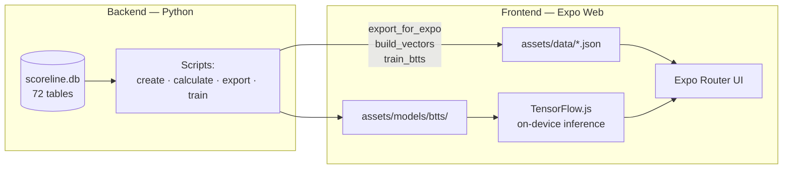

# Scoreline Architecture

## Overview

Scoreline is a **monorepo** with two packages:

There is **no backend HTTP API** in Phase 1. The Python layer is an offline pipeline; the web app is fully static on Vercel.

---

## Frontend (`frontend/`)

| Layer | Technology |
|-------|------------|
| Framework | Expo SDK 54, Expo Router (static export) |
| UI | React Native Web, StyleSheet |
| ML inference | `@tensorflow/tfjs` (client-side) |
| Dev data | `mock/` TypeScript generators |
| Prod data | Bundled JSON from `assets/data/` |

### Navigation shell

- **`FlashscoreShell`** — header + league sidebar + main column
- **Routes:** `/`, `/league/:id`, `/match/:id`, `/team/:slug`, `/analytics`

### Match intelligence (nested under Stats tab + Summary)

- **Our Stats** — 72-table stats dashboard
- **ML Predictions** — `useModel` + `PredictionBar`
- **Evidence** — `useSimilarMatches` (vector similarity)
- **Fusion / Bet Slip** — odds fusion workflow

---

## Backend (`backend/`)

| Script | Output |
|--------|--------|
| `create_db.py` | Empty `scoreline.db` + schema |
| `calculate_stats.py` | Populated stats + traffic-light signals |
| `export_for_expo.py` | `team_stats.json`, `fixtures.json`, `scaler.json` |
| `build_vectors.py` | `similar_matches.json` |
| `train_btts.py` | TF.js BTTS model (optional) |

### Signal thresholds (dev prompt)

| Signal | Threshold |
|--------|-----------|
| Green | ≥ 65% |
| Yellow | 45–64% |
| Red | < 45% |

---

## Data flow (development)

1. **Quick path (no Python):** `npm run export-data` reads `frontend/mock/` → writes JSON.
2. **Full path:** `npm run db:setup` → `npm run db:export` reads SQLite → writes JSON.
3. **Frontend build:** `npm run build` runs export-data then `expo export -p web`.
4. **Runtime:** App imports JSON at build time; TF.js loads scaler/model on match Summary.

---

## Deployment

| Setting | Value |
|---------|-------|
| Platform | Vercel (static) |
| Root config | `/vercel.json` |
| Build | `cd frontend && npm install && npm run build` |
| Output | `frontend/dist/` |

---

## Project phases

| Phase | Focus | Status |
|-------|-------|--------|
| 1 | Data collection, seed data, SQLite | In progress (mock) |
| 2 | 72 tables, 100+ stats, signals | Mock complete |
| 3 | Streams & groupings | Pending |
| 4 | Strategy engine + odds fusion | UI scaffolded |
| 5 | Bet slip + dashboard | UI scaffolded |

---

## Future (production)

When live APIs are enabled (Flashscore, Footy Stats, Odds Alert, etc.):

- Scrapers feed **backend** ingestion scripts.
- SQLite remains source of truth; export pipeline unchanged.
- **Frontend swap:** replace mock imports with same JSON shape — no ML/UI rewrite.

See [Football_Analytics_Project_Spec.md](./Football_Analytics_Project_Spec.md) for full requirements.
