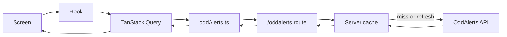
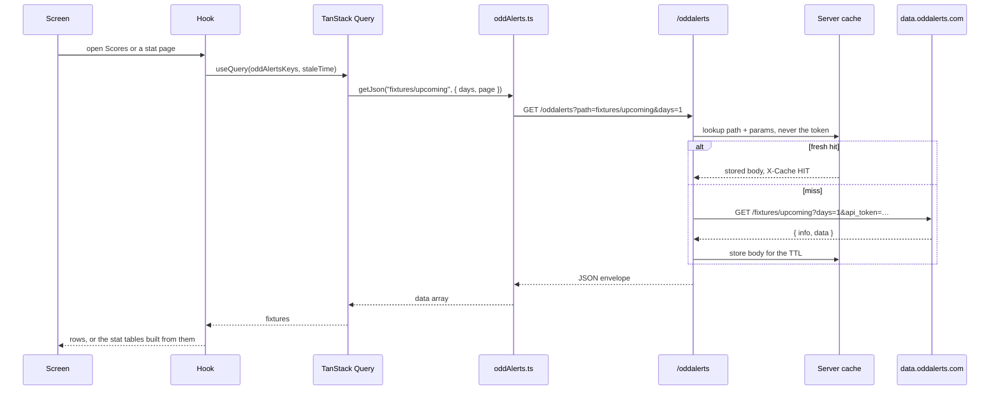
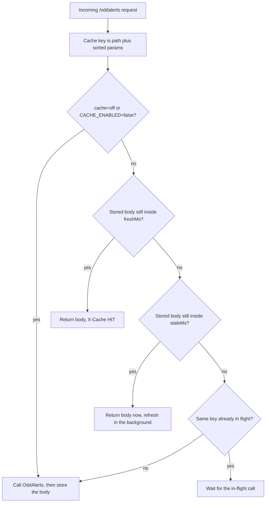
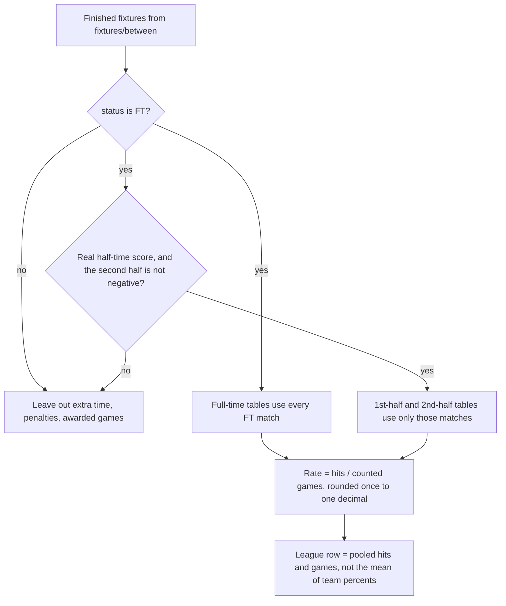
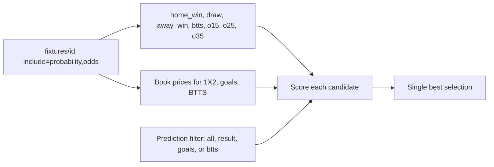
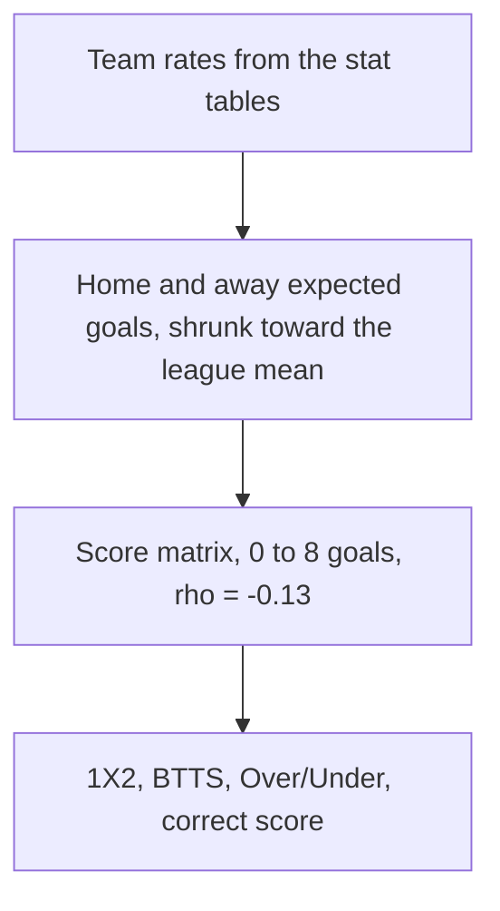
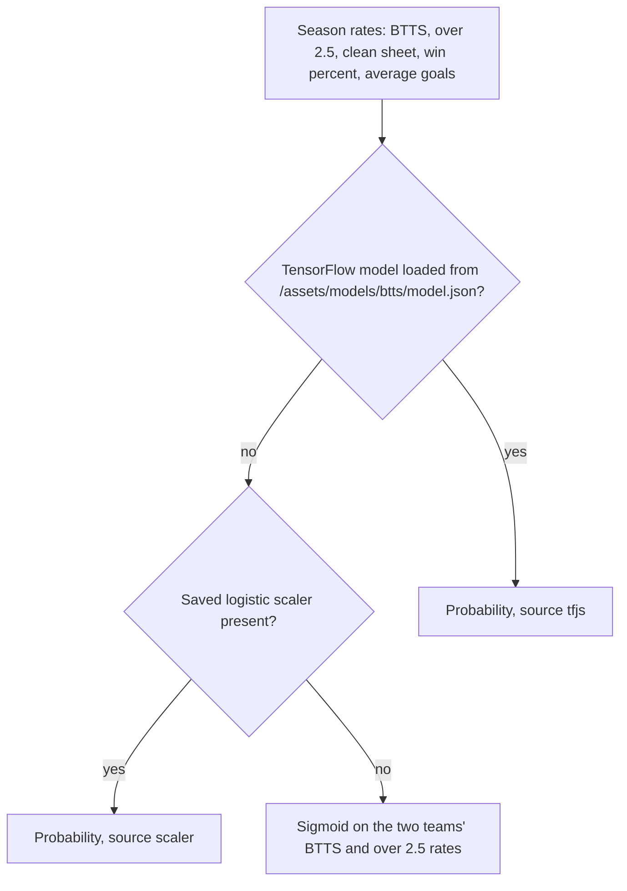

# How Scoreline pulls data from the API

This is the map of how the app asks OddAlerts for football data, where that request travels, and what each file on that path is for.

The browser never talks to OddAlerts directly. OddAlerts does not send CORS headers, and the API token must stay on the server. A screen asks a hook. The hook asks `frontend/services/oddAlerts.ts`. On the web that function calls our own `/oddalerts` route. That route adds the token, checks a short cache, and fetches `https://data.oddalerts.com/api`.





On iOS and Android the same `oddAlerts.ts` functions can call OddAlerts directly when `EXPO_PUBLIC_ODDALERTS_PROXY` is not an absolute URL. The web build always uses `/oddalerts`.

Two other feeds use the same idea, with their own routes:

| Feed | Browser calls | Server route | Upstream |
| --- | --- | --- | --- |
| OddAlerts (scores, stats, odds model) | `/oddalerts?path=…` | `frontend/app/oddalerts+api.ts` | `https://data.oddalerts.com/api` |
| API-Football (goal and card timeline) | `/football?path=fixtures` | `frontend/app/football+api.ts` | `https://v3.football.api-sports.io` |
| Hollywoodbets (book odds) | `/hollywood?host=…&path=…` | `frontend/app/hollywood+api.ts` | Hollywoodbets hosts listed in that file |

Production on Vercel does not add a second API. `api/index.js` boots the Expo server bundle, and that bundle already contains the three routes above.

---

## 1. How a query is built

Every OddAlerts call is a GET. The token is a query parameter named `api_token`. The app never puts that parameter in browser URLs.

### What the screen sends

`buildUrl()` in `frontend/services/oddAlerts.ts` turns a path plus parameters into one of two URLs.

Web (and native when a proxy URL is configured):

```
GET /oddalerts?path=fixtures/upcoming&days=1&page=1
```

Native, direct:

```
GET https://data.oddalerts.com/api/fixtures/upcoming?days=1&page=1&api_token=SERVER_TOKEN
```

`path` is the upstream path with no leading slash. Extra keys (`days`, `page`, `from`, `to`, `competitions`, `include`, …) are copied through. The proxy drops `path`, `api_token`, and `cache` before it builds the upstream URL, then sets `api_token` itself.

### What the server allows

`oddalerts+api.ts` rejects any path whose first segment is not in this list:

`fixtures`, `value`, `trends`, `odds`, `stats`, `bookmakers`, `players`, `referees`, `countries`, `competitions`, `teams`, `meta`

A path like `../something` is stripped. A missing token returns HTTP 500. An upstream failure returns HTTP 502 with `{ error, detail }`.

Add `cache=off` on the browser URL to skip the server cache for that one call. The proxy removes `cache` before the upstream request.

### What comes back

Successful JSON looks like:

```json
{
  "info": { "next_page_url": "…" },
  "data": []
}
```

`getJson()` returns that envelope. List helpers such as `fetchAllUpcomingFixtures` walk `info.next_page_url` and return only the `data` arrays joined together. A 200 response that is not JSON (OddAlerts sometimes returns a plain-text banner for a bad id) becomes `OddAlertsNonJsonError`. Callers such as `fetchFixtureDetail` treat that as “no such fixture” and return `null`.

### Worked queries

These are the browser forms. The server adds `api_token` and calls the same path on `data.oddalerts.com`.

| What you want | Browser query | Function |
| --- | --- | --- |
| Live and half-time | `/oddalerts?path=fixtures/live` | `fetchLiveFixtures` |
| Upcoming, one page | `/oddalerts?path=fixtures/upcoming&days=7&page=1` | `fetchUpcomingFixtures` |
| Upcoming, every page (cap 12) | same path, `page` incremented until `next_page_url` is empty | `fetchAllUpcomingFixtures` |
| Upcoming for starred leagues | `/oddalerts?path=fixtures/upcoming&days=7&competitions=423,419` | `fetchUpcomingForCompetitions` |
| Results in a time window | `/oddalerts?path=fixtures/between&from=UNIX&to=UNIX&page=1` | `fetchFixturesBetween` / `fetchAllFixturesBetween` |
| One match, model + odds + h2h | `/oddalerts?path=fixtures/12345&include=probability,stats,odds,h2h,referee` | `fetchFixtureDetail` |
| Corners, cards, offsides only | `/oddalerts?path=fixtures/12345&include=stats` | `fetchFixtureMatchStats` |
| Goal timing for one match | `/oddalerts?path=stats/fixture/12345` | `fetchFixtureGoalTiming` |
| Season table and team rates | `/oddalerts?path=stats/season/SEASON_ID` | `fetchSeasonStandings`, `fetchRawSeasonStats` |
| Finished matches for a season window | `/oddalerts?path=fixtures/between&from=UNIX&to=UNIX&competitions=ID` | `fetchSeasonResults` via `fetchAllFixturesBetween` |
| Competition list | `/oddalerts?path=competitions` | `fetchAllCompetitions` |
| Countries | `/oddalerts?path=countries` | `fetchCountries` |
| Value bets | `/oddalerts?path=value/upcoming` | `fetchUpcomingValue` |

Unix times are seconds, not milliseconds. `from` and `to` on `fixtures/between` are those seconds.

Pages that show “men’s club” matches do not send that filter to OddAlerts. The API has no gender or national-team field. `detectGender` and `detectKind` in `oddAlerts.ts` label each fixture from the competition name and the `" W"` team-name suffix, and the screen filters afterwards.

### How the Scores page chooses an endpoint

`useLiveFixtures` is the Scores feed and the Upcoming matches dropdown on the stat pages.

| View | Upstream | Notes |
| --- | --- | --- |
| `ns` (Fixtures) | `fixtures/upcoming` | `days` follows the Today / 3 / 7 / 14 control. Favourites with a saved league list uses `fetchUpcomingForCompetitions`. Otherwise `fetchAllUpcomingFixtures` (max 12 pages). |
| `ft` (Results) | `fixtures/between` | `from` is now minus N days. Only rows whose status is `FT` stay. |
| `live` | `fixtures/live` | Polls every 25 seconds. |
| `all` | `fixtures/live` and `fixtures/upcoming` | Same 25 second poll. |

The stat pages call `useLiveFixtures('ns', { upcomingDays: 7, upcomingScope: 'all' })`, so they use the same upcoming fetch as Scores with “all competitions”, then keep men’s club fixtures whose kickoff falls in the selected window.

### How stats pages turn fixtures into tables

They do not call a “stats table” endpoint. They download finished fixtures and count them locally.

1. `useSlStats` loads competitions, then `fixtures/between` for each season window, plus upcoming fixtures and, where needed, `fixtures/{id}?include=stats`.
2. `useLiveStatsTables` / `useCatalogueTables` do the same for one competition, or reuse the SL-STATS finished list when the board is “all leagues”.
3. `frontend/services/statsBuilder.ts` counts those matches into the ordinary, points-per-game, series, full-time-only, and league-average tables.

A status of `FT` is a full-time result. Extra time and penalties are not counted as ordinary full-time. Half-time rows need a real half-time score.

### Response headers from our proxy

| Header | Meaning |
| --- | --- |
| `X-Cache: HIT` | Fresh copy served from memory or Redis. OddAlerts was not called. |
| `X-Cache: STALE` | Expired copy served immediately. A refresh runs in the background. |
| `X-Cache: MISS` | OddAlerts was called. The body is stored. |
| `X-Cache: COALESCE` | Another request for the same URL was already in flight. This call waited for that one. |
| `X-Cache: BYPASS` | `cache=off`, or caching is disabled. |
| `Server-Timing` | Milliseconds spent inside `fetchThroughCache`. |

The browser is told `Cache-Control: private, max-age=0`. Freshness is the server TTL plus TanStack Query’s `staleTime`, not the HTTP cache.

---

## 2. Cache and query keys

Two caches sit on top of each other.

**Server** (`oddAlertsServerCache.ts`), keyed by path + sorted query string, never by the token:

| Path | Fresh | Stale (served while a refresh runs) |
| --- | --- | --- |
| `fixtures/live` | 10s | 10s |
| `fixtures/upcoming`, `value/upcoming` | 20s | 20s |
| `fixtures/{id}` | 15s | 15s |
| `fixtures/between` | 60s | 60s |
| `stats/season`, `stats/fixture`, `players/fixture` | 60s | 120s |
| `countries`, `competitions`, `bookmakers` | 5 min | 10 min |
| Anything else allowed | 30s | 30s |

Override with `ODDALERTS_CACHE_TTLS` (JSON of `{ "fixtures/live": { "freshMs": 10000, "staleMs": 10000 } }`). Set `CACHE_ENABLED=false` to pass every call through. At most `ODDALERTS_UPSTREAM_CONCURRENCY` upstream calls run at once (default 12).

**Client** (`queryClient.ts`):

- Retry a failed query once.
- Do not refetch just because the window regained focus.
- Drop unused data after 5 minutes (`gcTime`).
- Each hook sets `staleTime` from `clientStaleTime(path)`, which is the server fresh TTL for that path.

Query keys live in `oddAlertsKeys`. Two screens that want the same upcoming page share one request. A different `include=` list, or raw season stats versus the mapped standings rows, gets its own key so one shape is never returned as the other.

Do not pass a screen’s `AbortSignal` into a shared `queryFn`. TanStack aborts that signal when the component unmounts, and the shared fetch would die for everyone else. `getJson` already joins identical in-flight calls and only aborts the network request when every listener has aborted.



---

## 3. Models we use

The API sends fixtures, season rates, a probability object, and bookmaker odds. The app does not train on those calls. Three pure models run in the browser after the JSON arrives. A fourth, smaller BTTS model is a fallback on the web when a saved network file is present.

### Stats model

Ordinary, Additional, FT-Only, and the SL-STATS rates all start from the same finished-match list. `statsBuilder.ts` counts them. It does not average already-rounded team percentages.



Rescued points average the points taken only on games the team trailed at half-time. Blown points average the points dropped only on games the team led. If that situation never happened, the cell is blank.

### Best-bet model on a fixture row

Scores and the Upcoming matches dropdown use this model. Opening **Best bet** loads `fixtures/{id}?include=probability,stats,odds,h2h,referee`. The probability object is the OddAlerts model, already in percent. `predictionFromApiProbability` turns it into fractions. `buildRecommendation` then ranks one pick.



For a pre-match row the probabilities are used as published. For a live row, a remaining-time Poisson (`buildScoreMatrix` in `predictionEngine.ts`) rebuilds 1X2, BTTS, and the goal lines from the current score and the minutes left.

Each candidate’s rank is:

`probability × (1 − 0.25 × risk) + a small edge bonus`

Edge is model probability minus the probability implied by the book price. Positive edge nudges the pick up, capped at 0.08. Risk goes up when the match is live and level, the price has no value, or the sides are close. The Prediction dropdown on the stat pages only limits which of the three modules may enter that ranking. It does not call a different endpoint.

| Module | Candidates |
| --- | --- |
| Result | Home, draw, away |
| Goals | Over/under 1.5, 2.5, 3.5 |
| BTTS | Yes, no |

### Table prediction model

When a screen predicts from the stat tables instead of the fixture-detail probability object, it uses `frontend/services/predictionEngine.ts`. That file is a TypeScript port of `backend/prediction`. It is a Dixon-Coles bivariate Poisson.



Expected goals are clamped between 0.15 and 5.0. The home prior is 1.45 and the away prior is 1.15 until a team has enough matches. Six prior matches pull a thin sample toward the league average.

### Local BTTS fallback

`hooks/useModel.ts` is a separate web-only path. It is not what the Scores **Best bet** button uses.



Over 2.5 on this hook is always the heuristic. The fixture row’s best bet stays on the OddAlerts probability object plus `buildRecommendation`.

---

## 4. File structure

```
Odds-APP/
├── api/
│   └── index.js                         Vercel entry. Boots the Expo server bundle.
├── docs/
│   ├── HOW_WE_QUERY_THE_API.md          This guide.
│   ├── ODDALERTS_INTEGRATION.md         Older tour of the scores UI and filters.
│   ├── ODDALERTS_API_DATA_CATALOG.md    Field-by-field list of what OddAlerts returns.
│   └── ODDALERTS_API_GAPS.md            Fields the API does not provide.
└── frontend/
    ├── app/
    │   ├── _layout.tsx                  Mounts QueryClientProvider around every screen.
    │   ├── oddalerts+api.ts             OddAlerts proxy. Token, allow-list, cache.
    │   ├── football+api.ts              API-Football proxy for match events.
    │   ├── hollywood+api.ts             Hollywoodbets proxy for book odds.
    │   ├── teamlogo+api.ts              Badge lookup proxy.
    │   ├── (scores)/                    Scores, match, league, and team routes.
    │   ├── analytics/                   Analytics hub route.
    │   ├── sl-stats/                    SL-STATS route.
    │   ├── additional-stats/            Additional stats route.
    │   ├── stats-ordinary/              Ordinary stat board route.
    │   └── full-time-stats/             Full-time-only stat board route.
    ├── services/
    │   ├── oddAlerts.ts                 Every OddAlerts path the app calls.
    │   ├── oddAlertsKeys.ts             TanStack Query keys.
    │   ├── oddAlertsCachePolicy.ts      TTLs and the cache-key string.
    │   ├── oddAlertsServerCache.ts      Memory + Redis cache and singleflight.
    │   ├── queryClient.ts               Shared TanStack Query client.
    │   ├── apiTrafficLog.ts             Counts calls. Never logs the token.
    │   ├── fixtureCache.ts              Short client cache around season fixture pulls.
    │   ├── statsBuilder.ts              Turns finished fixtures into stat tables.
    │   ├── footyMarketStats.ts          SL-STATS rates (BTTS, lines, corners, cards).
    │   ├── apiFootball.ts               Client for the /football proxy.
    │   └── hollywoodbets.ts             Client for the /hollywood proxy.
    ├── server/
    │   └── oddAlertsCache.ts            Re-export of the server cache for tests.
    ├── hooks/                           One hook per screen concern. Listed below.
    └── components/                      UI. Screens call hooks. They do not build URLs.
```

`frontend/server/` is only that re-export. New server code belongs in `frontend/services/` or `frontend/app/`. Metro does not bundle a new top-level `frontend/server` module into the client.

---

## 5. What each file does

### Entry and routes

| File | Role |
| --- | --- |
| `api/index.js` | Vercel’s one function. It loads `frontend/dist/server` with `@expo/server`. Page requests and `/oddalerts`, `/football`, `/hollywood` all go through that bundle. |
| `frontend/app/_layout.tsx` | Root layout. Wraps the navigator in `QueryClientProvider` and `SafeAreaProvider`. No data fetching of its own. |
| `frontend/app/oddalerts+api.ts` | The only place the OddAlerts token is attached. Checks the path allow-list, calls `fetchThroughCache`, returns the raw upstream body plus `X-Cache`. |
| `frontend/app/football+api.ts` | Same pattern for API-Football. Only the `fixtures` prefix is allowed. Uses `API_FOOTBALL_KEY`. Fills goals, cards, and substitutions, which OddAlerts does not list as events. |
| `frontend/app/hollywood+api.ts` | Proxies four Hollywoodbets hosts. The browser sends `host` and `path`. The route checks both against an allow-list and forwards the Origin Hollywoodbets expects. No token. |
| `frontend/app/teamlogo+api.ts` | Small proxy so team badges can load without a browser CORS failure. |

### The OddAlerts client

| File | Role |
| --- | --- |
| `frontend/services/oddAlerts.ts` | The client API. `buildUrl` picks proxy vs direct. `getJson` dedupes in-flight calls, parses the `{ info, data }` envelope, and records traffic. Exports the fetch functions in the table in section 1, plus `mapFixture`, `detectGender`, `detectKind`, `groupByCompetition`, and `normaliseStatus`. Screens should call these functions, not `fetch` OddAlerts themselves. |
| `frontend/services/oddAlertsKeys.ts` | Stable query keys: live, upcoming, between, one fixture, one match, season stats, fixture timing, competitions, and the scores feed. |
| `frontend/services/oddAlertsCachePolicy.ts` | Names each path, returns fresh/stale milliseconds, builds the cache key, and exposes `clientStaleTime` for hooks. |
| `frontend/services/oddAlertsServerCache.ts` | Stores the full upstream body. Serves a fresh hit, serves a stale body while refreshing, joins identical in-flight calls, and optionally writes Redis (Upstash REST) when those env vars exist. Bodies larger than `ODDALERTS_CACHE_MAX_BYTES` (default 8 MB) stay in memory only. |
| `frontend/services/queryClient.ts` | One `QueryClient` for the whole app. Retry 1, no refetch on focus, five-minute garbage collection. |
| `frontend/services/apiTrafficLog.ts` | Logs method, path, status, bytes, and cache result. `publicParams` strips `api_token` before anything is printed. |
| `frontend/services/fixtureCache.ts` | A small timed cache in front of repeated season fixture downloads so changing a stat filter does not reload the same `fixtures/between` pages. |
| `frontend/server/oddAlertsCache.ts` | Re-exports the server cache so tests can import it from a stable path. Not a second implementation. |

### Turning payloads into stats

| File | Role |
| --- | --- |
| `frontend/services/statsBuilder.ts` | Pure calculator. Input is finished fixtures already downloaded. Output is the ordinary, PPG, series, full-time-only, and league-average tables for full-time, first half, and second half, at overall, home, and away. It does not call the network. |
| `frontend/services/footyMarketStats.ts` | SL-STATS maths on the same fixtures: both-teams-to-score, goal lines, halves, corners, cards, offsides, and the quick filters. |
| `frontend/services/apiFootball.ts` | `fetchMatchEvents` and `fetchMatchGoals` through `/football`. Used by the match screen for the timeline. |
| `frontend/services/hollywoodbets.ts` | Sports, categories, tournaments, events, and event detail through `/hollywood`. |
| `frontend/services/hollywood1x2Board.ts` | Pulls 1X2 prices for a set of OddAlerts fixtures so a row can show a book price next to the model. |

### Hooks (who queries what)

| File | Queries | Used by |
| --- | --- | --- |
| `hooks/useLiveFixtures.ts` | Live, upcoming, or between, depending on the Scores tab. | `LiveScoresFeed` on Scores. `UpcomingMatchesPanel` on Analytics, SL-STATS, Additional, Ordinary, and FT-Only. |
| `hooks/useLiveCompetitions.ts` | `competitions` for the sidebar. | Scores shell / league sidebar. |
| `hooks/useMatchDetail.ts` | `fixtures/{id}` with probability, stats, odds, h2h, referee; season standings; squads; fixture goal timing; API-Football events. | Match screen. |
| `hooks/useLiveFixturePredictions.ts` | Fixture detail for the open row’s best bet. | `FeedFixtureRow` on Scores and on the stat-page dropdown. Loaded only after the row is expanded. |
| `hooks/useFixtureStreamlines.ts` | Season standings plus up to 80 fixture details, to label a match’s “stream”. | Scores feed. Not used by the stat-page dropdown, so those pages do not fan out into dozens of detail calls. |
| `hooks/useFixtureSeries.ts` | Season results for the two teams. | Series panel on a fixture row. |
| `hooks/useFixtureFormAnalysis.ts` | Season results and standings for form. | Match / standings analysis. |
| `hooks/useFixtureBook1x2.ts` | Hollywood 1X2 for one fixture. | Match odds comparison. |
| `hooks/useSeasonFixtures.ts` | `fixtures/between` for one competition season. | Standings and season lists. |
| `hooks/useStandings.ts` | `stats/season/{id}` mapped to a table. | Standings panel. |
| `hooks/useGroupStandings.ts` | Standings for each group in a competition. | Group tables. |
| `hooks/useTeamUpcoming.ts` | Upcoming fixtures for one team. | Team screen. |
| `hooks/useSlStats.ts` | Competitions, season `fixtures/between`, upcoming, and match stats. Holds the SL-STATS catalogue. | SL-STATS, and the “all leagues” stat boards. |
| `hooks/useLiveStatsTables.ts` | One competition’s finished fixtures, then `statsBuilder`. | A single league on Ordinary, FT-Only, and Additional. |
| `hooks/useCatalogueTables.ts` | Switches between `useLiveStatsTables` (one league) and `useSlStats` (all loaded leagues). | `StatBoardScreen`, `StatsTablesPanel`. |
| `hooks/useFootyStats.ts` | SL-STATS market rates for the Footy tab. | Analytics footy panel. |
| `hooks/useSimilarMatches.ts` | Historical matches similar to the current fixture. | Match insight. |
| `hooks/useHollywoodOdds.ts` | Hollywood event markets. | Odds panels. |
| `hooks/useHollywoodPopularOdds.ts` | A short list of popular events and prices. | Strategies and odds fusion when those tabs are open. |
| `hooks/useHollywoodHunt.ts` | Search across Hollywood events. | Finder / hunt UI. |
| `hooks/useHollywoodNav.ts` | Sports, categories, tournaments. | Hollywood browser. |
| `hooks/useHollywoodExport.ts` | Packages the current Hollywood selection. | Export action. |
| `hooks/useStats.ts` | Reads the built tables for a team view. | Team and stats UI that consumes `statsBuilder` output. |
| `hooks/useModel.ts` | Local model helpers on top of a fixture detail. | Prediction cards. |
| `hooks/useAnalyticsBetSlip.ts` | In-memory slip. No API. | Analytics bet slip. |
| `hooks/useSavedStrategies.ts` | Saved strategies in local storage. No API. | Strategies tab. |

### Screens that start a fetch

| File | Role |
| --- | --- |
| `components/home/LiveScoresFeed.tsx` | Scores page. Calls `useLiveFixtures`, groups by competition, renders `FeedFixtureRow`. |
| `components/scores/FeedFixtureRow.tsx` | One Scores row. The match line is instant. “Best bet” calls `fetchFixtureDetail` the first time it opens. |
| `components/scores/UpcomingMatchesPanel.tsx` | The dropdown on Analytics, SL-STATS, Additional, Ordinary, and FT-Only. Same `useLiveFixtures` upcoming call and the same `FeedFixtureRow`. The Prediction filter only changes which market `buildRecommendation` may pick. It does not call a different endpoint. |
| `components/stat-board/StatBoardScreen.tsx` | Ordinary and FT-Only. Data from `useCatalogueTables`. Passes the ranked column into the prediction filter (`focusForStatKey`). |
| `components/sl-stats/SlStatsScreen.tsx` | SL-STATS. Data from `useSlStats`. The analysis (BTTS, goals, win/draw/loss, corners, …) sets the prediction filter. |
| `components/additional-stats/AdditionalStatsScreen.tsx` | Additional stats via `StatsTablesPanel`. Prediction filter starts on Result. |
| `components/analytics/AnalyticsHub.tsx` | Analytics sections. Prediction filter follows the open section. |
| `components/analytics/StatsTablesPanel.tsx` | Renders the tables `useCatalogueTables` built. |
| `components/match/MatchScreen.tsx` | Match page. Data from `useMatchDetail`. |

UI files under `components/layout`, `components/shared`, and the stat table cells do not construct API URLs.

---

## 6. Configuration

Set these in `frontend/.env`. Do not commit the file. Do not print the token values.

| Variable | Where it is read | Purpose |
| --- | --- | --- |
| `ODDALERTS_TOKEN` | `oddalerts+api.ts` only | Server token sent to OddAlerts. Preferred. |
| `EXPO_PUBLIC_ODDALERTS_TOKEN` | Server route if `ODDALERTS_TOKEN` is empty, and native direct calls | Fallback. Anything `EXPO_PUBLIC_` can be inlined into the native app. |
| `EXPO_PUBLIC_ODDALERTS_PROXY` | `oddAlerts.ts` | Default `/oddalerts`. Web ignores an absolute value and stays on `/oddalerts`. Native uses it when it is `https://…`. |
| `EXPO_PUBLIC_ODDALERTS_BASE_URL` | `oddAlerts.ts` | Direct base URL. Default `https://data.oddalerts.com/api`. |
| `CACHE_ENABLED` | cache policy | `false` or `0` disables the server cache. |
| `ODDALERTS_CACHE_TTLS` | cache policy | JSON overrides for fresh/stale windows. |
| `ODDALERTS_UPSTREAM_CONCURRENCY` | server cache | Max simultaneous OddAlerts calls. Default 12. |
| `ODDALERTS_CACHE_MAX_BYTES` | server cache | Largest body written to Redis. Default 8_000_000. |
| `API_FOOTBALL_KEY` | `football+api.ts` | API-Football key. Server only. |
| `UPSTASH_REDIS_REST_URL` and `UPSTASH_REDIS_REST_TOKEN` | `oddAlertsServerCache.ts` | Optional Redis. Without both, the cache is in-memory only, per server process. |

---

## 7. Adding a new query

1. Add a function in `frontend/services/oddAlerts.ts` that calls `getJson('family/…', params, signal)`. The family must already be in `ALLOWED_PREFIXES`, or you must add it there on purpose.
2. If a screen will cache it, add a key in `oddAlertsKeys.ts` and a `useQuery` in a hook under `frontend/hooks/`. Set `staleTime: clientStaleTime('that/path')`.
3. If the path needs its own TTL, add a branch in `ttlNameFor` inside `oddAlertsCachePolicy.ts`.
4. Map the raw row into a small type in the service. Leave counting and ranking to `statsBuilder.ts` or `footyMarketStats.ts` so the network layer stays a fetch.

Do not call `https://data.oddalerts.com` from a component. Do not read `ODDALERTS_TOKEN` in client code. Do not pass the component abort signal into a shared query function.
